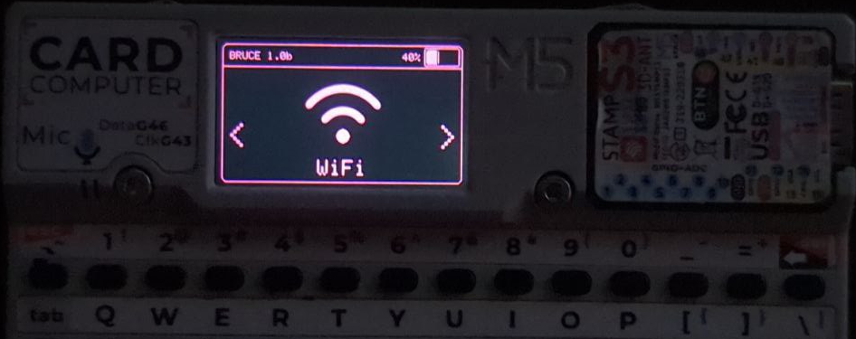
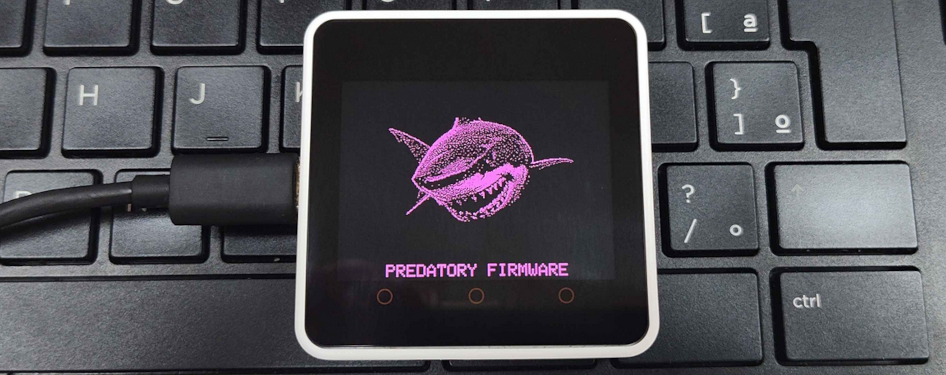
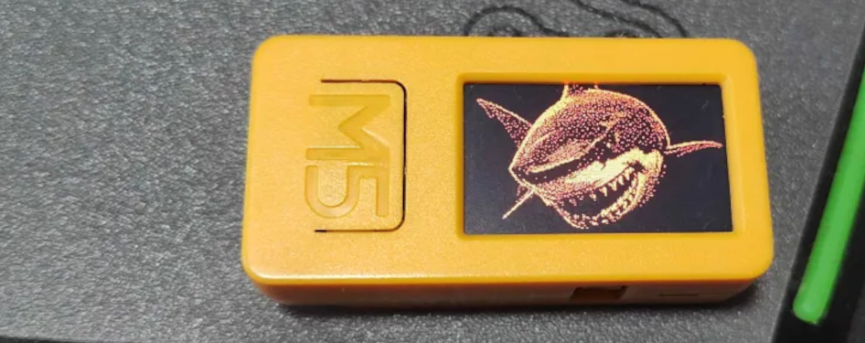
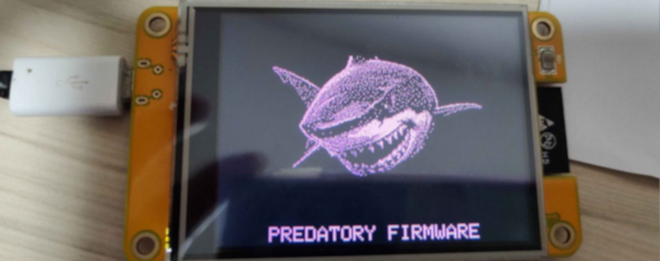

# :shark: Bruce

Bruce é um firmware versátil para ESP32 que suporta diversos recursos ofensivos focados em facilitar operações de Red Team.
Também suporta produtos m5stack e funciona perfeitamente com Cardputer, Sticks, M5Cores, T-Decks e T-Embeds.

## :building_construction: Como instalar

### A maneira mais fácil de instalar o Bruce é usando nosso Web Flasher oficial!
### Acesse: https://bruce.computer/flasher

Alternativamente, você pode baixar o binário mais recente das releases ou actions e fazer o flash localmente usando esptool.py
```sh
esptool.py --port /dev/ttyACM0 write_flash 0x00000 Bruce-<device>.bin
```

**Para dispositivos m5stack**

Se você já usa o M5Launcher para gerenciar seu dispositivo m5stack, você pode instalá-lo via OTA

Ou você pode gravar diretamente através da [ferramenta m5burner](https://docs.m5stack.com/en/download), basta procurar por 'Bruce' (Minhas builds oficiais serão enviadas por "owner" e têm fotos.) na categoria do dispositivo que você deseja e clicar em burn

## :keyboard: Servidor Discord

Entre em contato conosco em nosso [Servidor Discord](https://discord.gg/WJ9XF9czVT)!

## :bookmark_tabs: Wiki

Para mais informações sobre cada função suportada pelo Bruce, [leia nossa wiki aqui](https://github.com/pr3y/Bruce/wiki).
Além disso, [leia nosso FAQ](https://github.com/pr3y/Bruce/wiki/FAQ)

## :computer: Lista de Recursos

<details>
  <summary><h2>WiFi</h2></summary>
  
- [x] Conectar ao WiFi  
- [x] WiFi AP  
- [x] Desconectar WiFi  
- [x] [Ataques WiFi](https://github.com/pr3y/Bruce/wiki/WiFi#wifi-atks)
  - [x] [Beacon Spam](https://github.com/pr3y/Bruce/wiki/WiFi#beacon-spam)
  - [x] [Ataque Direcionado](https://github.com/pr3y/Bruce/wiki/WiFi#target-atk)
    - [x] Informação
    - [x] Deauth Direcionado
    - [x] EvilPortal + Deauth
  - [x] Deauth Flood (Mais de um alvo)  
- [x] [Wardriving](https://github.com/pr3y/Bruce/wiki/Wardriving)  
- [x] [TelNet](https://github.com/pr3y/Bruce/wiki/WiFi#telnet)  
- [x] [SSH](https://github.com/pr3y/Bruce/wiki/WiFi#ssh)  
- [x] [Sniffer RAW](https://github.com/pr3y/Bruce/wiki/WiFi#raw-sniffer)  
- [x] [Cliente TCP](https://github.com/pr3y/Bruce/wiki/WiFi#tcp-client)  
- [x] [Listener TCP](https://github.com/pr3y/Bruce/wiki/WiFi#tcp-listener)  
- [x] [DPWO-ESP32](https://github.com/pr3y/Bruce/wiki/WiFi#dpwo-esp32)  
- [x] [Portal Malicioso](https://github.com/pr3y/Bruce/wiki/WiFi#evil-portal)  
- [x] [Escanear Hosts](https://github.com/pr3y/Bruce/wiki/WiFi#evil-portal)  
- [x] [Tunelamento Wireguard](https://github.com/pr3y/Bruce/wiki/WiFi#wireguard-tunneling)  
- [x] Brucegotchi
  - [x] Amigo do Pwnagotchi  
  - [x] Spam de rostos e nomes no Pwngrid  
    - [x] [Opcional] DoScreen com nome e rosto muito longos  
    - [x] [Opcional] Flood de identificadores únicos de pares  

</details>

<details>
  <summary><h2>BLE</h2></summary>
    
- [X] [Escaneamento BLE](https://github.com/pr3y/Bruce/wiki/BLE#ble-scan)
- [X] Bad BLE - Executa scripts Ducky, similar ao [BadUsb](https://github.com/pr3y/Bruce/wiki/Others#badusb)
- [X] Teclado BLE - Apenas Cardputer e T-Deck
- [X] Spam iOS
- [X] Spam Windows
- [X] Spam Samsung
- [X] Spam Android
- [X] Spam Geral
</details>


<details>
  <summary><h2>RF</h2></summary>
    
- [x] Escanear/Copiar
- [x] [SubGhz Personalizado](https://github.com/pr3y/Bruce/wiki/RF#replay-payloads-like-flipper)
- [x] Espectro
- [x] Jammer Total (envia uma onda quadrada completa na saída)
- [x] Jammer Intermitente (envia sinal PWM na saída)
- [x] Configuração
    - [X] Pino TX RF
    - [X] Pino RX RF
    - [X] Módulo RF
        - [x] RF433 T/R M5Stack
        - [x] [CC1101 (Sub-Ghz)](https://github.com/pr3y/Bruce/wiki/CC1101)
    - [X] Frequência RF
- [x] Replay
</details>

<details>
  <summary><h2>RFID</h2></summary>
    
- [x] Ler tag
- [x] Ler 125kHz
- [x] Clonar tag
- [x] Escrever registros NDEF
- [x] Amiibolink
- [x] Chameleon
- [x] Escrever dados
- [x] Apagar dados
- [x] Salvar arquivo
- [x] Carregar arquivo
- [x] Configuração
    - [X] [Módulo RFID](https://github.com/pr3y/Bruce/wiki/RFID#supported-modules)
        - [x] PN532
- [ ] Emular tag
</details>

<details>
  <summary><h2>IR</h2></summary>
    
- [x] TV-B-Gone
- [x] Receptor IR
- [x] [IR Personalizado (NEC, NECext, SIRC, SIRC15, SIRC20, Samsung32, RC5, RC5X, RC6)](https://github.com/pr3y/Bruce/wiki/IR#replay-payloads-like-flipper)
- [x] Configuração
    - [X] Pino TX IR
    - [X] Pino RX IR
</details>

<details>
  <summary><h2>FM</h2></summary>
    
- [x] [Transmissão padrão](https://github.com/pr3y/Bruce/wiki/FM#play_or_pause_button-broadcast-standard)
- [x] [Transmissão reservada](https://github.com/pr3y/Bruce/wiki/FM#no_entry_sign-broadcast-rerserved)
- [x] [Parar transmissão](https://github.com/pr3y/Bruce/wiki/FM#stop_button-broadcast-stop)
- [ ] [Espectro FM](https://github.com/pr3y/Bruce/wiki/FM#ocean-fm-spectrum)
- [ ] [Sequestrar Anúncios de Tráfego](https://github.com/pr3y/Bruce/wiki/FM#car-hijack-ta)
- [ ] [Configuração](https://github.com/pr3y/Bruce/wiki/FM#bookmark_tabs-config)
</details>

<details>
  <summary><h2>NRF24</h2></summary>
    
- [X] [Jammer NRF24](https://github.com/pr3y/Bruce/wiki/BLE#nrf24-jammer)
- [X] Espectro 2.4G
- [ ] Mousejack
</details>

<details>
  <summary><h2>Scripts</h2></summary>
    
- [X] [Interpretador JavaScript](https://github.com/pr3y/Bruce/wiki/Interpreter) [Créditos para justinknight93](https://github.com/justinknight93/Doolittle)
</details>

<details>
  <summary><h2>Outros</h2></summary>
    
- [X] Espectro do Microfone
- [X] QRCodes
    - [x] Personalizado
    - [x] PIX (sistema de transferência bancária brasileiro)
- [x] [Gerenciador de Cartão SD](https://github.com/pr3y/Bruce/wiki/Others#sd-card-mngr)
    - [x] Visualizar imagem (jpg)
    - [x] Informações do arquivo
    - [x] [Upload para Wigle](https://github.com/pr3y/Bruce/wiki/Wardriving#how-to-upload)
    - [x] Reproduzir áudio
    - [x] Visualizar arquivo
- [x] [Gerenciador LittleFS](https://github.com/pr3y/Bruce/wiki/Others#littlefs-mngr)
- [x] [WebUI](https://github.com/pr3y/Bruce/wiki/Others#webui)
    - [x] Estrutura do servidor
    - [x] Html
    - [x] Gerenciador SDCard
    - [x] Gerenciador Spiffs
- [x] Megalodon
- [x] [BADUsb (Novos recursos, LittleFS e SDCard)](https://github.com/pr3y/Bruce/wiki/Others#badusb)
- [x] Teclado USB - Apenas Cardputer e T-Deck
- [x] [Openhaystack](https://github.com/pr3y/Bruce/wiki/Others#openhaystack)
- [x] [iButton](https://github.com/pr3y/Bruce/wiki/Others#ibutton)
- [x] [Controle LED](https://github.com/pr3y/Bruce/wiki/Others#led-control)
</details>

<details>
  <summary><h2>Relógio</h2></summary>
    
- [X] Suporte RTC
- [X] Ajuste de hora NTP
- [X] Ajuste manual
</details>

<details>
  <summary><h2>Conectar (ESPNOW)</h2></summary>
    
- [X] Enviar arquivo
- [X] Receber arquivo
</details>

<details>
  <summary><h2>Configurações</h2></summary>
    
- [x] Brilho
- [x] Tempo de escurecimento
- [x] Orientação
- [X] Cor da UI
- [x] Som de inicialização on/off
- [x] Relógio
- [x] Modo dormir
- [x] Reiniciar
</details>

## Funções específicas por dispositivo, as não mencionadas aqui estão disponíveis para todos.
| Device                  | CC1101    | NRF24    | Interpreter  | FM Radio  | PN532     | Mic   | BadUSB    | RGB Led | Speaker   | Fuel Guage | LITE_MODE |
| ---                     | :---:     | :---:    | :---:        | :---:     | :---:     | :---: | :---:     | :---:   | :---:     | :---:      | :---:     |
| [M5Stack Cardputer](https://shop.m5stack.com/products/m5stack-cardputer-kit-w-m5stamps)       | :ok:      | :ok:     | :ok:         | :ok:      | :ok:      | :ok:  | :ok:      | :ok:    | NS4168    | :x:        | :x:       |
| [M5Stack M5StickC PLUS2](https://shop.m5stack.com/products/m5stickc-plus2-esp32-mini-iot-development-kit)  | :ok:      | :ok:     | :ok:         | :ok:      | :ok:      | :ok:  | :ok:¹     | :x:     | Tone      | :x:        | :x:       |
| [M5Stack M5StickC PLUS](https://shop.m5stack.com/products/m5stickc-plus-esp32-pico-mini-iot-development-kit)   | :ok:      | :ok:     | :x:          | :ok:      | :ok:      | :ok:  | :ok:¹     | :x:     | Tone      | :x:        | :x:²      |
| [M5Stack M5Core BASIC](https://shop.m5stack.com/products/basic-core-iot-development-kit)    | :x:       | :x:      | :x:          | :x:       | :x:       | :ok:  | :ok:¹     | :x:     | Tone      | :x:        | :x:       |
| [M5Stack M5Core2 v1.1](https://shop.m5stack.com/products/m5stack-core2-esp32-iot-development-kit-v1-1)    | :x:       | :x:      | :x:          | :x:       | :x:       | :ok:  | :ok:¹     | :x:     | :x:       | :x:        | :x:       |
| [M5Stack M5CoreS3](https://shop.m5stack.com/products/m5stack-cores3-esp32s3-lotdevelopment-kit)/[SE](https://shop.m5stack.com/products/m5stack-cores3-se-iot-controller-w-o-battery-bottom)     | :x:       | :x:      | :ok:         | :x:       | :x:       | :x:   | :ok:      | :x:     | :x:       | :x:        | :x:       |
| [JCZN CYD&#x2011;2432S028](https://www.aliexpress.us/item/3256804774970998.html)       | :ok:      | :ok:     | :ok:         | :x:       | :ok:      | :x:   | :ok:¹     | :x:     | :x:       | :x:        | :x:²      |
| [Lilygo T&#x2011;Embed CC1101](https://lilygo.cc/products/t-embed-cc1101)   | :ok:      | :x:      | :ok:         | :x:       | :ok:      | :ok:  | :ok:      | :ok:    | :ok:      | :ok:       | :x:       |
| [Lilygo T&#x2011;Embed](https://lilygo.cc/products/t-embed)          | :x:       | :x:      | :ok:         | :x:       | :ok:      | :ok:  | :ok:      | :ok:    | :ok:      | :x:        | :x:       |
| [Lilygo T&#x2011;Deck](https://lilygo.cc/products/t-deck) ([and pro](https://lilygo.cc/products/t-deck-plus-1)) | :x:       | :x:      | :ok:         | :x:       | :x:       | :x:   | :ok:      | :x:     | :x:       | :x:        | :x:       |

² CYD e StickCPlus 1.1 têm uma versão LITE_VERSION para Compatibilidade com o Launcher
¹ BadUSB para Core, CYD e StickCs: [aqui](https://github.com/pr3y/Bruce/wiki/Others#badusb)

*LITE_MODE*: TelNet, SSH, DPWO, WireGuard, ScanHosts, RawSniffer, Brucegotchi, BLEBacon, BLEScan, Interpreter e OpenHaystack NÃO estão disponíveis para Compatibilidade com M5Launcher


## :sparkles: Por que e como é?

O Bruce surgiu de uma observação atenta dentro da comunidade focada em dispositivos como o Flipper Zero. Embora esses dispositivos oferecessem uma visão do mundo da segurança ofensiva, havia uma sensação palpável de que algo mais poderia ser alcançado sem ser tão caro, particularmente com o robusto e modular ecossistema de hardware fornecido pelos dispositivos ESP32, produtos Lilygo e M5Stack.






Outras mídias podem ser [encontradas aqui](./media/).

## :clap: Agradecimentos

+ [@bmorcelli](https://github.com/bmorcelli) por novo core e vários recursos novos, além de portar para muitos dispositivos!
+ [@IncursioHack](https://github.com/IncursioHack) por adicionar recursos dos módulos RF e RFID.
+ [@Luidiblu](https://github.com/Luidiblu) pela logo e assistência no design da UI.
+ [@eadmaster](https://github.com/eadmaster) por adicionar muitos recursos.
+ [@rennancockles](https://github.com/rennancockles) por muito código RFID, refatoração e outros recursos.
+ [@7h30th3r0n3](https://github.com/7h30th3r0n3) refatoração e muita ajuda com ataques WiFi.
+ [Smoochiee]() pelo design da PCB do Bruce.
+ [TH3_KR4K3N]() pelo design da PCB do extensor Stick cplus.
+ Todos que contribuíram de alguma forma para o projeto, obrigado :heart:

## :construction: Aviso Legal

Bruce é uma ferramenta para operações ofensivas cibernéticas e de red team, distribuída sob os termos da Licença Pública Geral Affero (AGPL). É destinada apenas para fins de teste de segurança legal e autorizado. O uso deste software para quaisquer atividades maliciosas ou não autorizadas é estritamente proibido. Ao baixar, instalar ou usar o Bruce, você concorda em cumprir todas as leis e regulamentos aplicáveis. Este software é fornecido gratuitamente, e não aceitamos pagamentos por cópias ou modificações. Os desenvolvedores do Bruce não assumem nenhuma responsabilidade por qualquer uso indevido do software. Use por sua conta e risco.
